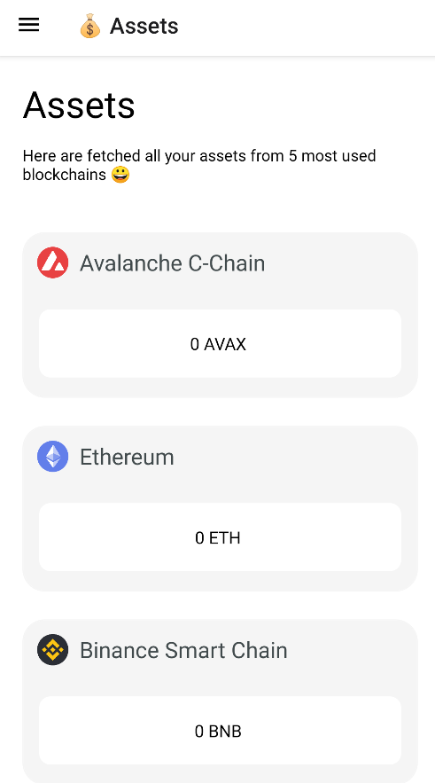

# Mobile Wallet
Is an react native mobile app, where users connect their wallet (via Wallet Connect) and see all their token balances on all chains. They can also see all their NFTs and historical transactions. In periods of high gas prices, an integrated gas price tracker can be very handy. Users can create contacts and transfer assets to them very easily.

Please leave a ⭐ if you like it.

If you find any **errors** ⛔, please report them to [cleancode198@gmail.com](mailto:cleancode198@gmail.com) thanks 🙏.

## Technologies
For this project I used:
- [React Native](https://reactnative.dev/)
- [Moralis](https://moralis.io/) for authentication and database

## About Me
Hi! 👋 I'm Jin, passionate **web and blockchain developer**. Take a look at my [portfolio](https://jinkong.netlify.com).

You can get in touch with me through my [website](https://jinkong.netlify.com) or contact me on [linkedin](https://linkedin.com/in/jinkong198).

Do you like my work? You can support me by donating to this address: 0xf18432a6d3C6f8720227C2856dEE97B6d99357EF

## License
[MIT](https://choosealicense.com/licenses/mit/)
